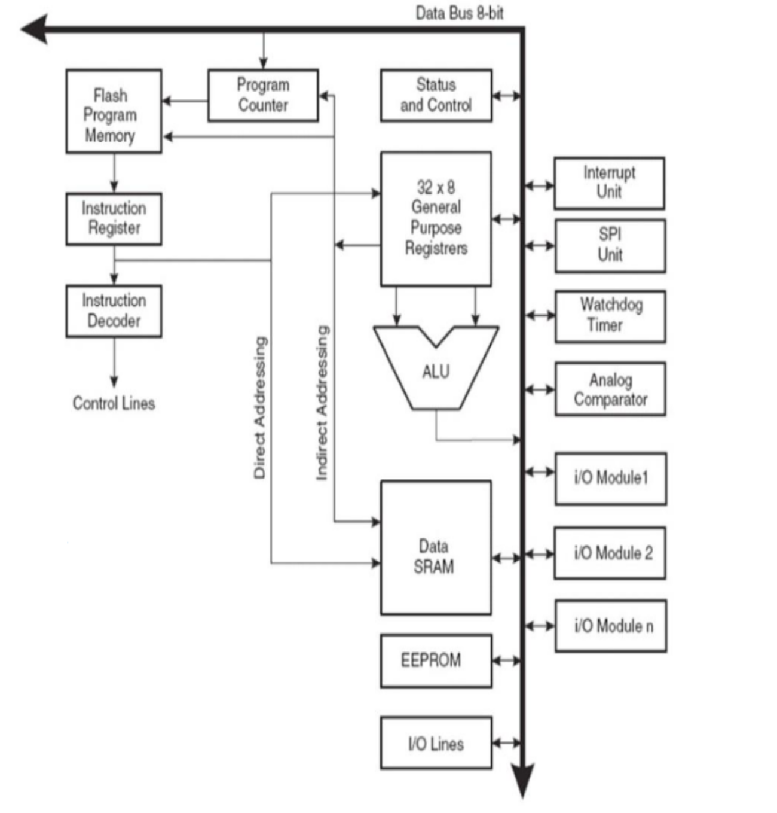
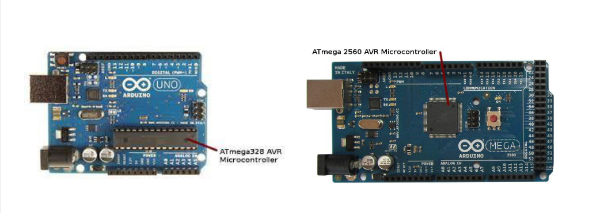
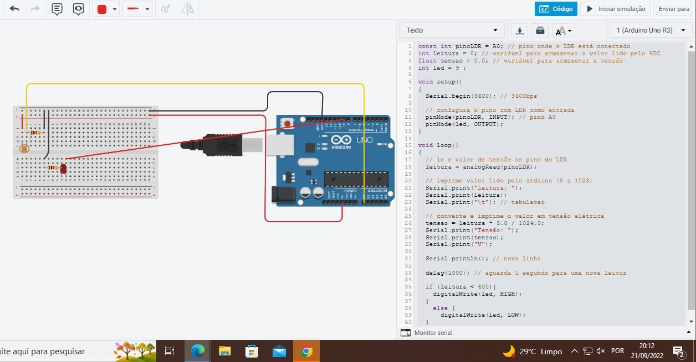

# Aula-5
Exercício da Aula 5 de Microprocessadores e Microcontroladores do curso de Engenharia de Computação da universidade Centro Universitário das Américas - FAM
 
 # Aula 5 - Microprocessadores e Microcontroladores

## Oque é MIPS?

**MIPS**, acrônimo para (*Microprocessor without interlocked pipeline stages*) é uma arquitetura de processador que foi desenvolvida pela MIPS Technologies, Inc. em 1981. A arquitetura MIPS é uma arquitetura de 32 bits, com 32 registradores de 32 bits, e 64 registradores de 64 bits.


A arquitetura MIPS é uma arquitetura de registradores, com 32 registradores de 32 bits, e 64 registradores de 64 bits.

- A arquitetura MIPS é uma arquitetura de pipeline, ou seja, 
o processador MIPS é composto por vários estágios de execução, e cada estágio executa uma instrução por vez. 
A arquitetura MIPS é uma arquitetura de pipeline com 5 estágios de execução, sendo eles:

  - **IF** - Instruction Fetch, ou seja, busca de instruções.
  - **ID** - Instruction Decode, ou seja, decodificação de instruções.
  - **EX** - Execute, ou seja, execução de instruções.
  - **MEM** - Memory, ou seja, acesso a memória.
  - **WB** - Write Back, ou seja, escrita de resultados.


- A arquitetura MIPS é uma arquitetura de registradores, ou seja, o processador MIPS é composto por registradores, que são usados para armazenar valores, e para passar valores entre os estágios de execução do processador.

--- 

## CPU AVR 

A CPU é o núcleo(core) do microcontrolador, e é responsável por executar as instruções do programa. A CPU AVR é uma CPU de 8 bits, ou seja, ela é composta por 8 bits de dados, e 8 bits de endereços.

- A proposta é identificar oque cada caixinha desta faz:


### Através desta tabela irá identificar oque cada caixinha faz:

| Nome                             | Descrição                                                                                                                                                                                                                                                                                                               |
|----------------------------------|-------------------------------------------------------------------------------------------------------------------------------------------------------------------------------------------------------------------------------------------------------------------------------------------------------------------------|
| **Instruction Decoder**          | Decodifica as instruções, e identifica qual instrução está sendo executada.                                                                                                                                                                                                                                             |
| **Instruction Register**         | Armazena a instrução que está sendo executada, o registro de instruções é particularmente importante, pois é o único registro que pode ser lido e escrito durante a execução de uma instrução.                                                                                                                          |
| **Flash Program Memory**         | Armazena o programa que está sendo executado. A memória flash é uma memória não volátil, ou seja, ela mantém os dados armazenados mesmo quando a energia é desligada.                                                                                                                                                   |
| **Program Counter**              | Armazena o endereço da próxima instrução a ser executada. O Program Counter é incrementado automaticamente após a execução de cada instrução.                                                                                                                                                                           |
| **Status and Control**           | Armazena o status do processador, e controla o funcionamento do processador.                                                                                                                                                                                                                                            |
| **32x8 Gener Purpose Registers** | São registradores de 8 bits, que podem ser usados para armazenar valores, e para passar valores entre os estágios de execução do processador.                                                                                                                                                                           |
| **ALU**                          | Executa as operações aritméticas e lógicas. A ALU é composta por 4 registradores de 8 bits, e 1 registrador de 16 bits.                                                                                                                                                                                                 |
| **I/O Ports**                    | São portas de entrada e saída, que podem ser usadas para conectar o microcontrolador a outros dispositivos.                                                                                                                                                                                                             |
| **Data SRAM**                    | Armazena os dados que estão sendo usados pelo programa. Diferente da memória flash, a memória SRAM pode ser alterada durante a execução do programa.                                                                                                                                                                    |
| **EEPROM**                       | Armazena dados que não são perdidos quando o microcontrolador é desligado. A memória EEPROM é uma memória não volátil usada em computadores e outros dispositivos eletrônicos, para armazenar dados de configuração, como a data e hora, ou para armazenar dados que não são perdidos quando o dispositivo é desligado. |
| **I/O Lines**                    | São linhas de entrada e saída, que podem ser usadas para conectar o microcontrolador a outros dispositivos.                                                                                                                                                                                                             |
| **Interrupt Unit**               | Controla as interrupções do microcontrolador. Essas interrupções podem ser geradas por eventos externos, ou por eventos internos do microcontrolador.                                                                                                                                                                   |
| **SPI Unit**                     | Controla a comunicação serial SPI. SPI é uma sigla para Serial Peripheral Interface, ou seja, Interface Periférica Serial.                                                                                                                                                                                              |
| **Watchdog Timer**               | Controla o temporizador de watchdog. O temporizador de watchdog é usado para reiniciar o microcontrolador caso o programa não esteja respondendo.                                                                                                                                                                       |
| **Analog Comparator**            | Controla o comparador analógico. O comparador analógico é usado para comparar dois sinais analógicos, e gerar um sinal digital.                                                                                                                                                                                         |
| **i/O Module 1**                 | Controla o módulo de entrada e saída 1.                                                                                                                                                                                                                                                                                 |
| **i/O Module 2**                 | Controla o módulo de entrada e saída 2.                                                                                                                                                                                                                                                                                 |
| **i/O Module n**                 | Controla o módulo de entrada e saída n.                                                                                                                                                                                                                                                                                 |


## Qual é o microprocessador que está no Arduino Mega 2560?



- O microprocessador que está no Arduino Mega 2560 é o ATmega2560.

---

### Você foi encarregado de projetar um sistema que identifica quando anoitecer, a partir dessemomento devera ligar a luz. O projeto deverá ser feito com o Arduino.

- O projeto foi atribuido em sala de aula e sendo simulado no Tinkercad. 

Como pode observar, o projeto foi feito com o Arduino Uno, e o sensor de luminosidade foi o LDR.


- O código do projeto foi feito em C, e pode ser observado abaixo:

```c
const int pinoLDR = A0;             // pino onde o LDR está conectado
int leitura = 0;                    // variável para armazenar o valor lido pelo ADC
float tensao = 0.0;                 // variável para armazenar a tensão
int led = 9;

void setup()
{
    Serial.begin(9600); // 9600bps
   
    // configura o pino com LDR como entrada
    pinMode(pinoLDR, INPUT); // pino A0
    pinMode(led, OUTPUT);
}   

void loop()
{
    // lê o valor de tensão no pino do LDR
    leitura = analogRead(pinoLDR);

    // imprime valor lido pelo arduino (0 a 1023)
    Serial.print("Leitura: ");
    Serial.print (leitura);
    Serial.print("\t"); // tabulacao
  
    // converte e imprime o valor em tensão elétrica
    tensao leitura 5.0/ 1024.0;
    Serial.print("Tensão: ");
    Serial.print (tensao);
    Serial.println("V");
    
    Serial.println(); // nova linha
    
    delay(1000); // aguarda 1 segundo para uma nova leitura do sensor
    
    if (leitura < 600) 
    {
      digitalWrite(led, HIGH);
    }
    else
    {
      digitalWrite(led, LOW);
    }
}
```

