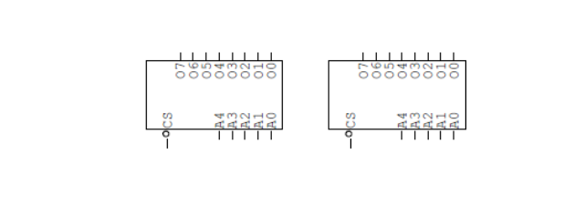
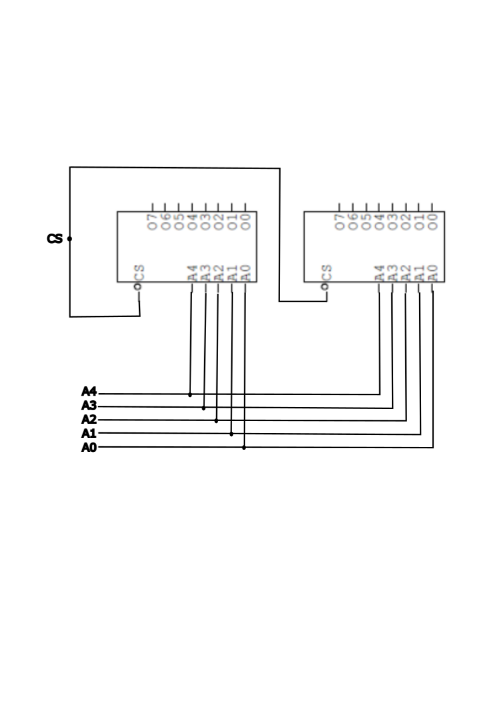
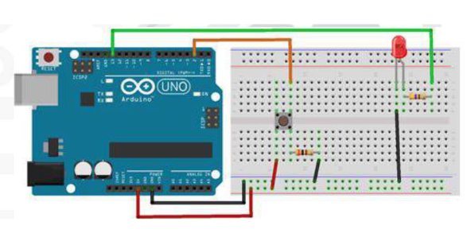
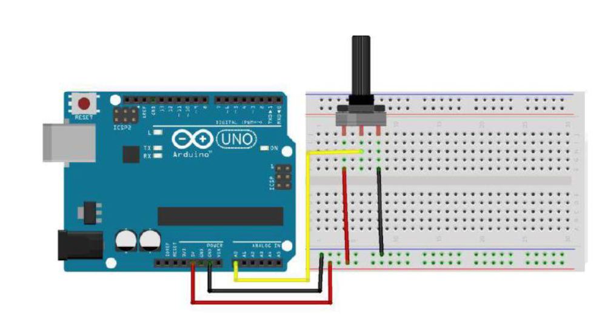
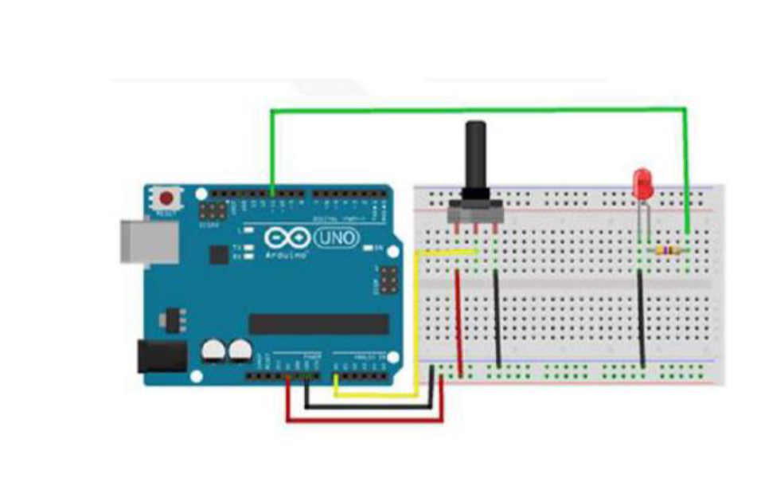

# Microprocessadores e Microcontroladores

---
## Tarefa correspondente à aula 1

### O que é um microprocessador? Elabore um texto histórico.

- O microprocessador é um circuito integrado que contém um processador de 8 ou 16 bits, ou seja, ele pode processar 8 ou 16 bits por vez, e são programados em linguagem de máquina, ou seja, em 0 e 1.

### Quais componentes são necessários?

- Sabendo que um microprocessador não trabalha sozinho e nem pode ser programado, ele apenas executa as funções que outros componentes externos lhe enviam.

Para que o microprocessador possa ser programado, diga quais são os componentes necessários.
- Necessita de outros componentes externos, sendo eles:
  - memória de leitura e escrita (armazenamento de dados);
  - memória somente de leitura (armazenamento de programas);
  - dispositivo ou memória (armazenamento permanente de dados);
  - dispositivos periféricos
  - conversores
  - interfaces

### Oque é um Arduino?

- O Arduino é uma plataforma de prototipagem eletrônica de código aberto baseada em hardware e software livre, projetada para facilitar a criação de projetos eletrônicos interativos.

- O Arduino é uma placa de circuito impresso que pode ser programada para interagir com o ambiente através de uma entrada e saída de dados.

**Para desenvolvimento de sistemas embarcados, o Arduino é uma boa opção?**

- Sim, pois ele é uma boa opção para desenvolvimento de sistemas embarcados, pois ele é uma placa de circuito impresso que pode ser programada para interagir com o ambiente através de uma entrada e saída de dados, assim como a Raspberry Pi.

**Qual a diferença entre um Raspberry Pi e um Arduino?**

- O Raspberry Pi é um computador de placa única, sendo programado na linguagem Python, que pode ser usado para vários fins, como por exemplo, para desenvolvimento de sistemas embarcados, enquanto o Arduino é uma placa de circuito impresso que pode ser programada para interagir com o ambiente através de uma entrada e saída de dados.

### Oque significa compilar o programa?

- Compilar o programa significa traduzir o código fonte para o código objeto, ou seja, o código fonte é traduzido para o código objeto, que é o código binário que o microprocessador entende.


- Ou seja, tudo oque digitamos no programa será convertido em comandos binários, que são os comandos que o microcontrolador entende.


- Assim que compilamos, o compilador cria um arquivo com a extensão `.HEX`, que obedece ao padrão e formatação hexadecimal.


- O arquivo `.HEX` é o arquivo que será gravado na memória do microcontrolador, para que ele possa ser executado.

## Questões de programação

1. Escreva o código de funcionamento do circuito.


```c
int led = 12;

void setup() {
  pinMode(led, OUTPUT);
}
void loop() {
  digitalWrite(led, HIGH);
  delay(1000);
  digitalWrite(led, LOW);
  delay(1000);
}
```
2. Escreva o código de funcionamento do circuito.


```c
int ledred = 11;
int ledgreen = 12;
int ledyellow = 13;

void setup() {
    pinMode(ledred, OUTPUT);
    pinMode(ledgreen, OUTPUT);
    pinMode(ledyellow, OUTPUT);
}
void loop() {
    digitalWrite(ledred, HIGH);
    delay(5000);
    digitalWrite(ledred, LOW);
    
    digitalWrite(ledyellow, HIGH);
    delay(3000);
    digitalWrite(ledyellow, LOW);
    
    digitalWrite(ledgreen, HIGH);
    delay(5000);
    digitalWrite(ledgreen, LOW);
}
```
3. Escreva o código de funcionamento do circuito.


Sequencial de LEDS:

Código:
```c
int ledPin[] = {11, 12, 13};
int ledState[] = {LOW, LOW, LOW};
int ledTime[] = {1000, 2000, 3000};
int ledIndex = 0;

void setup() {
  for (int i = 0; i < 3; i++) {
    pinMode(ledPin[i], OUTPUT);
  }
}
void loop() {
  digitalWrite(ledPin[ledIndex], ledState[ledIndex]);
  delay(ledTime[ledIndex]);
  ledState[ledIndex] = !ledState[ledIndex];
  ledIndex = (ledIndex + 1) % 3;
}
```
---
## Tarefa correspondente a aula 3

## Questões de programação

Pesquisa nos computadores atuais temos memoria RAM instalada:
- Que tipo de memorias são?
> São memórias voláteis, ou seja, perdem o conteúdo quando desligadas.

- Qual o tipo de comunicação
> A comunicação é feita através de barramentos.

- Como são classificadas?
> São classificadas como memórias de acesso aleatório.

---
#### **Qual a diferença entre EPROM, EEPROM, FLASH e RAM?**

> EPROM: É uma memória ROM programável e apagável, que pode ser apagada por exposição à luz ultravioleta.

> EEPROM: É uma memória ROM programável e apagável, que pode ser apagada por exposição à luz ultravioleta.

> FLASH: É uma memória ROM programável e apagável, que pode ser apagada por exposição à luz ultravioleta.

> RAM: É uma memória de acesso aleatório, ou seja, é possível ler e escrever em qualquer posição da memória.

---
### Exercício 1

1. Para os dois circuitos integrados da figura a seguir, determine o número de registradores utilizando a fórmulas via anteriormente.


a)
> Para o circuito **(a)**: 2^5 linhas endereço = 32 palavras de 8 bits.

b)
> Para o circuito **(b)**: 2^10 linhas endereço = 1024 palavras de 8 bits.

### Exercício 2

2. Interconecte as duas memórias a seguir para forma uma única memória com o dobro de registradores. A memória resultante deve ter seis vias de endereços e oito saídas de dados.



- A memória resultante é a seguinte:


--- 
## Monte o circuito

### Exercício 3

Use os seguintes materiais:
- Botão de pressão
- 1 Resistor de 10kΩ
- 1 Resistor de 470Ω
- 1 LED 5mm
- Jumpers
- Protoboard
- Arduino UNO R3



Código:
```c
int led = 13;
int botao = 2;

int buttonState = 0;

void setup() {
  pinMode(led, OUTPUT);
  pinMode(botao, INPUT);
  
  Serial.begin(9600);
}
void loop() {
  buttonState = digitalRead(botao);
  
  if (buttonState == HIGH) {
    digitalWrite(led, HIGH);
    Serial.println("LED ligado");
  } else {
    digitalWrite(led, LOW);
    Serial.println("LED desligado");
  }
}
```
---
### Exercício 4

Pergunta no projeto acima, foi usado um pull-up ou pull-down? Justifique.
> Foi usado um pull-up, pois o botão de pressão é um botão de contato aberto, ou seja, quando não está pressionado, o pino do botão está em nível alto.

--- 
### Exercício 5

Monte o circuito.
Use os seguintes materiais:
- Potenciômetro linear de 10kΩ
- Jumpers
- Protoboard



Código:
```c
unsigned int valorObtido;

void setup() {
  Serial.begin(9600);
}
void loop() {
  valorObtido = analogRead(A0);
  Serial.println(valorObtido);
  delay(1000);
}
```
Como se chama essa conexão elétrica? Descreve que cada linha do programa faz.
> A conexão elétrica é uma conexão analógica, pois o Arduino lê o valor da tensão de entrada e converte para um valor digital.

> A função `analogRead()` lê o valor analógico de um pino e retorna um valor entre 0 e 1023.

> A função `Serial.println()` envia um valor para a porta serial.

> A função `delay()` faz com que o programa espere um determinado tempo antes de continuar a execução.

> A função `Serial.begin()` inicia a comunicação serial.

> A função `setup()` é executada apenas uma vez, no início do programa.

> A função `loop()` é executada repetidamente, até que o programa seja interrompido.,

---

### Exercício 6

Monte o circuito.
Use os seguintes materiais:
- Potenciômetro linear de 10kΩ
- LED 5mm
- 1 Resistor de 470Ω
- Jumpers
- Protoboard
- Arduino UNO R3



Código:
```c
int led = 11;
int potenciometro = A5;

unsigned int valorObtido;
unsigned int pwm;

void setup() {
  pinMode(led, OUTPUT);
}

void loop() {
  valorObtido = analogRead(potenciometro);
  pwm = map(valorObtido, 0, 1023, 0, 255);
  analogWrite(led, pwm);
}
```
Descreva o que cada linha do programa faz.
> A função `analogRead()` lê o valor analógico de um pino e retorna um valor entre 0 e 1023.

> A função `map()` mapeia um valor de entrada para um valor de saída.

> A função `analogWrite()` escreve um valor analógico (PWM) em um pino.

> A função `pinMode()` define o modo de operação de um pino.

> A função `setup()` é executada apenas uma vez, no início do programa.

> A função `loop()` é executada repetidamente, até que o programa seja interrompido.

> A função `delay()` faz com que o programa espere um determinado tempo antes de continuar a execução.

---
### Para pensar:

E se eu desejar interromper o programa? Como faço isso?

> Para interromper o programa, basta pressionar o botão de reset do Arduino.
